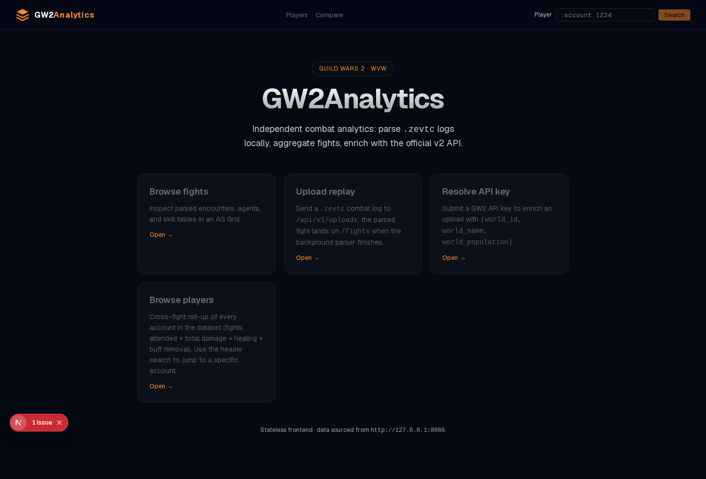
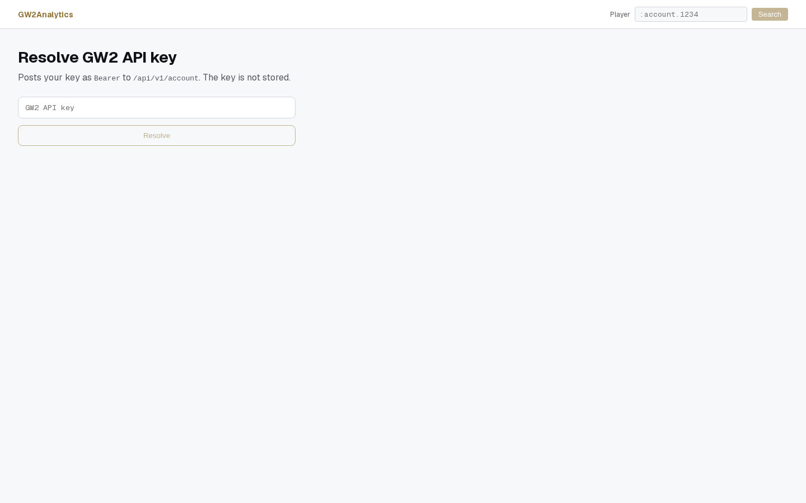
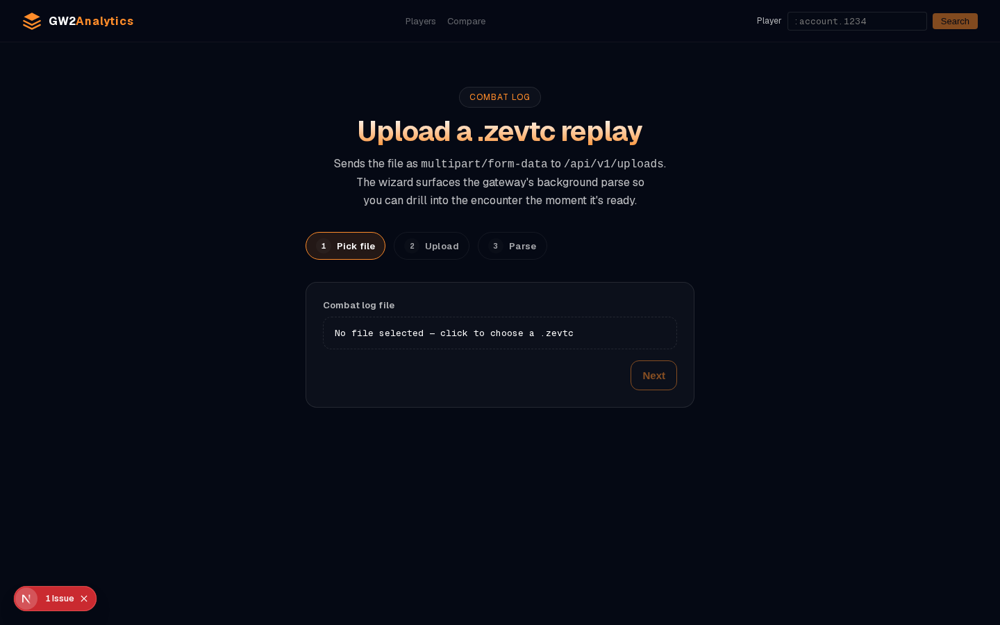
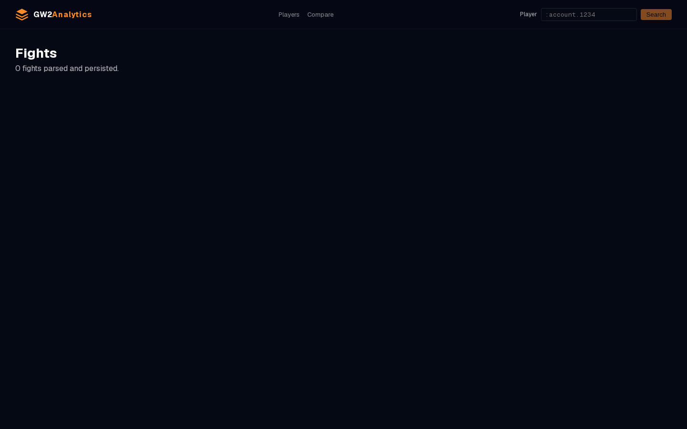
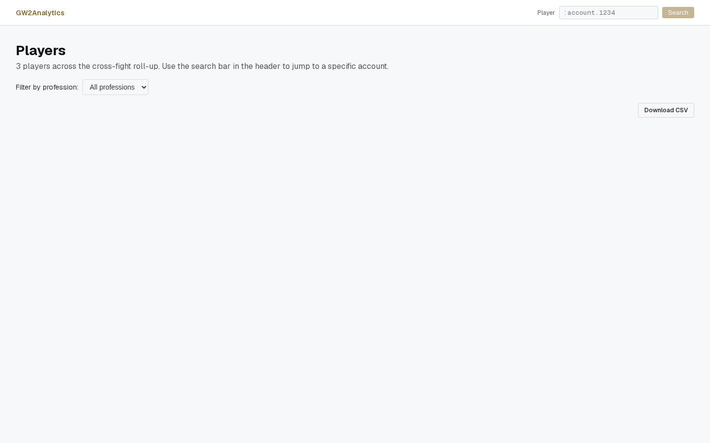
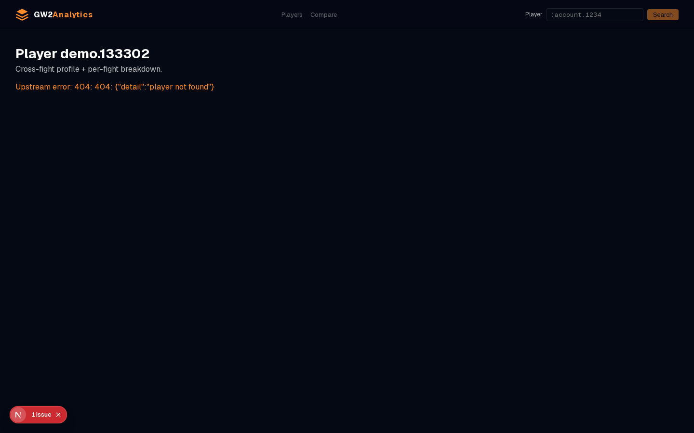
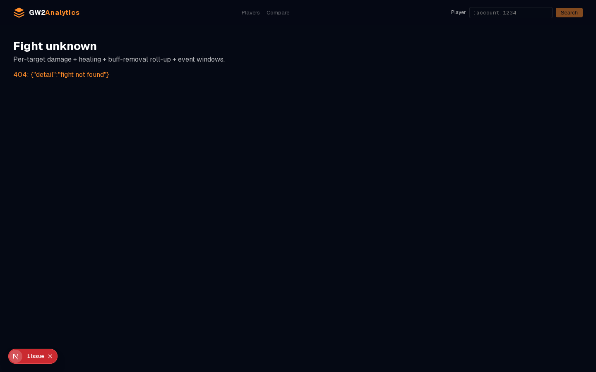

# GW2Analytics

[](https://github.com/Roddygithub/Gw2Analytics/actions/workflows/ci.yml)
[](https://github.com/Roddygithub/Gw2Analytics/tags)

**Modern combat analytics platform for Guild Wars 2 WvW (World vs World).**

> Independent third-party platform — no dps.report, no Elite Insights web.
> WvW combat logs (`.zevtc`) are parsed locally and stored in a stable
> internal model from which all analytics, API, and frontend derive.

**Status:** Latest tagged release: `v0.9.1` · **v0.10.2–v0.10.10** cycle close-out **committed on `main`** (`[Unreleased]` in CHANGELOG; tags pending operator ceremony) · **v0.10.23-pre Wave 6 + 7 SCAFFOLD close-out merged to `main`** — Phase 3 SCAFFOLD-getter plumbing (`dps_split_getter` + `barrier_portion_getter` + `buff_removal_events` + Boons `⚠️ BREAKING` union-key fix) + Combat-readout UI (4 NEW AG Grid Community 34 Client Components sharing `<PlayerReadoutBase>` + `/fights/[id]?tab=readout` routing) + **account_name colon-prefix normalisation** (strip leading `:` at persistence time, Alembic migration `0014_strip_account_colon`, defensive `lstrip(':')` on all player-facing routes, and E2E retrocompatibility coverage). `gw2_core` 0.6.0 / `gw2_analytics` 0.8.0 / `apps/api` 0.8.6. ([Unreleased] in CHANGELOG; tags pending operator ceremony) — heuristic role detection + per-player timeline overlay + blob cache + containerised Postgres standardisation on `:5432` + pgcrypto-free secret-at-rest envelope encryption (OWASP CWE-256) + Caddyfile security headers (HSTS + CSP + frame-ancestors) + CI security hardening (pip-audit + pnpm audit) + cluster-dep recovery (6 HIGH-risk dependabot PRs deferred to v0.10.9 with `redis>=5.0,<8`, `ag-grid-{community,react} ^34`, `jsdom ^25`, `@types/node ^20.19` ceiling pins) + **v0.10.9 audit hardening cycle** — shipped 5 plans from the 2026-07-10 codebase audit ([master audit index](./plans/AUDIT-2026-07-10-79c4501.md)): Caddyfile HSTS/CSP hardening (008), CI `pip-audit`/`pnpm-audit` gates (009), Next.js `error.tsx`/`not-found.tsx` boundaries (010), Next.js `headers()` defense-in-depth (011), centralised `Settings` env-loading (016) + **CRITICAL fix on `GET /api/v1/players/compare/timeline`** ([plan 144](./plans/144-v0109-player-compare-keyerror-fix.md)) + **v0.10.10 cycle close-out** — true singleflight refactor on `routes/fights.py::_cached_get_events` (N concurrent cold-cache misses collapse to 1 MinIO GET + N-1 `future.result()` waiters via Future-dict + meta-lock; the existing `@functools.lru_cache(maxsize=8)` + per-URI latch stay as defence-in-depth for the nanosecond race window between the `finally` Future pop and the lru_cache atomic cache-write) + Phase 9 parser dual-channel event-emit (Step 2-EMIT raw + Step 3 APPLY + Step 3.5 real-fixture) + 7 inherited ruff-violation cleanup (PLC0415 + N802 + SIM300 + RUF059) in `libs/gw2_evtc_parser/tests/`. · **~718 active tests** (~603 pytest + ~115 vitest) across pytest + vitest + Playwright · strict CI lint + test + typecheck + OpenAPI drift gate + schema-drift guard + mypy --strict active.

## Highlights

- 🎯 **Per-target / per-subgroup / per-skill roll-ups** on every fight — DPS, healing, and buff removals via stable pydantic aggregations with deterministic ordering + cross-field invariants.
- 📈 **Account-level historical timelines** — per-day / per-fight bucketing, linear / log Y-axis, and player-name resolution on the fight drilldown's TargetFilter.
- 🔌 **Webhook subscriptions** for parse-completion notifications — HMAC-SHA256 signed, 3-attempt retry + DLQ + replay, with SSRF block (HTTPS-only + universal private-IP gate).
- 🎭 **Heuristic role detection** (v0.10.3) — per-(fight, account) DPS / HEAL / STRIP / BOON / MIXED classification from the 3 magnitudes + spec/profession hint table. Stored on `fight_player_summaries.detected_role` + `detected_tags`.
- 📊 **Per-player timeline overlay** (v0.10.3 Feature 3A) — `GET /api/v1/fights/{id}/timeline/players` returns one per-bucket series per player agent so the visx multi-line chart overlays N players on the same X-axis bucket grid.
- ⚔️ **Combat-readout UI** (Wave 7 / Workstream F, SCAFFOLD-mode) — per-player Damage / Heal / Boons / Defense 4-table roll-up via `/fights/[id]?tab=readout`. 4 NEW AG Grid Community 34 Client Components (Damage / Heal / Boons / Defense) sharing `<PlayerReadoutBase>` for the 5 shared identity columns (subgroup / name / elite_spec / `is_commander` / roles). Per-table default sort per design doc §13 (`subgroup ASC + dps_total/hps/boons_out_rate/damage_taken DESC + agent_id ASC` tiebreaker). SCAFFOLD-only: pre-`Phase 6 v2` streams render with `dps_power=0.0 + dps_condi=0.0 + barrier_total=0 + barrier_ps=0.0 + time_downed_ms=0` byte-equivalent zero values; the live wire wireup awaits the v0.11.0 backend `GET /api/v1/fights/{id}/readout` route handler. Forward-blocker #3 closes with this cycle.
- 🧪 **~718 automated tests** across `pytest` (~603), `vitest` (~115), and `Playwright` e2e — all green on every PR.
- 🛡️ **v0.10.9 audit hardening cycle** — Caddyfile HSTS/CSP + CI `pip-audit`/`pnpm-audit` + Next.js `error.tsx` / `not-found.tsx` boundaries + Next.js `headers()` defense-in-depth + centralised `Settings` env-loading + critical `KeyError` fix on `GET /players/compare/timeline` (broken since `v0.10.0` plan 032). See [`plans/AUDIT-2026-07-10-79c4501.md`](./plans/AUDIT-2026-07-10-79c4501.md) for the master audit index (11 self-contained plans, 6 shipped + 5 forward-looking).
- 📦 **Pure monorepo** — `libs/gw2_core` (no I/O), `libs/gw2_evtc_parser` (replaceable Protocol), `libs/gw2_analytics` (frozen pydantic), `apps/api` (FastAPI), `web` (Next.js 16).

## Documentation

| File | Purpose |
| --- | --- |
| [CHANGELOG.md](./CHANGELOG.md) | Canonical per-commit history (includes unreleased `v0.9.x` cycles). |
| [CONTRIBUTING.md](./CONTRIBUTING.md) | Workflow conventions, branch protection rules, CI gates. |
| [docs/ROADMAP.md](./docs/ROADMAP.md) | Forward-looking candidates and technical-debt ledger. |
| [plans/README.md](./plans/README.md) | Senior-advisor audit trails and scoped cycle implementation plans. |
| [docs/v0.8.0-backend-design.md](./docs/v0.8.0-backend-design.md) | The webhook subscription + delivery worker design. |

## Architecture

```
                              gw2_evtc_parser
                                     │
                                     ▼ produces
                                  gw2_core ◀──constrains── gw2_analytics
                                     │
                                     ▼
                                apps/api  ──gw2_api_client── GW2 v2
                                     │
                                     ▼
                                web (Next.js 16)
```

| Component | Role |
| --- | --- |
| `libs/gw2_core` | Stable Pydantic models (combat + API). Single source of truth. **No I/O.** |
| `libs/gw2_evtc_parser` | Binary `.zevtc` parser behind an `EvtcParser` Protocol. V1.3 layout. |
| `libs/gw2_analytics` | Single-, multi-fight, and event-driven aggregations. Frozen pydantic shapes with deterministic ordering + cross-field invariants. |
| `libs/gw2_api_client` | Typed async httpx wrapper for the Guild Wars 2 REST API v2. |
| `apps/api` | FastAPI gateway. MinIO blobs + Alembic + Postgres. See the [API surface](#api-surface) below. |
| `web` | Next.js 16 frontend. AG Grid Community tables + SSR fetches. OpenAPI codegen via `pnpm generate:api`. |

## API surface

| Method | Path | Description |
| --- | --- | --- |
| `POST` | `/api/v1/uploads` | Ingest a `.zevtc` log; returns 201 + `UploadCreatedResponse` (parse runs in background). |
| `GET` | `/api/v1/uploads/{id}` | Upload metadata. |
| `GET` | `/api/v1/fights[/{id}]` | List fights (paginated) or fetch a single fight. |
| `GET` | `/api/v1/fights/{id}/events` | Per-target trio (DPS + healing + buff removal) + per-bucket event windows. |
| `GET` | `/api/v1/fights/{id}/squads` | Per-subgroup roll-up. |
| `GET` | `/api/v1/fights/{id}/skills` | Per-skill hit count + damage / heal / strip totals. |
| `GET` | `/api/v1/fights/{id}/readout` | **Combat readout** — per-player Damage / Heal / Boons / Defense 4-table roll-up (SCAFFOLD-only: wire shape defined in `apps/api/src/gw2analytics_api/schemas/fight.py::FightReadoutOut`; the route handler `get_fight_readout` lands in v0.11.0 when the parser-side side-table emulator materialises the SCAFFOLD-getter params). |
| `GET` | `/api/v1/fights/{id}/timeline?window_s=N` | Per-fight temporal view (3-series, `M:SS` relative time). |
| `GET` | `/api/v1/players?profession=&limit=&offset=` | Cross-fight player roll-up (paginated). |
| `GET` | `/api/v1/players/{account_name:path}` | Player profile + per-fight breakdown. |
| `GET` | `/api/v1/players/{account_name:path}/timeline?bucket=day&tz=Continent/City` | Account-level historical timeline. |
| `POST/GET/DELETE` | `/api/v1/webhooks[/{id}]` | Webhook subscription management (HTTPS-only URLs). |
| `POST` | `/api/v1/webhooks/dlq/{delivery_id}/replay` | Replay a DLQ'd delivery (atomic; row-level locked). |
| `GET` | `/api/v1/health/summary` | Operational drift probe (binary `ok` / `drift`). |
| `GET` | `/api/v1/healthz` | Liveness probe. |
| `GET` | `/api/v1/account` | Bearer-protected world enrichment (uses `gw2_api_client`). |

## Screenshots

The web's 7 routes captured via `pnpm screenshots` + [Playwright](https://playwright.dev/) (full pages, 1440×900, headless Chrome). Refresh via `pnpm screenshots --persist` after a UI change.

| Route | Capture |
| --- | --- |
| `/` |  |
| `/account` |  |
| `/upload` |  |
| `/fights` |  |
| `/players` |  |
| `/players/[account_name]` |  |
| `/fights/[id]?tab=replay` |  (v0.10.17 Replay UI: seekable playback of the per-fight `/api/v1/fights/{id}/timeline?window_s=N` rollup with scrubber + play/pause/reset + 1x/2x/4x/8x speed toggle + per-bucket damage/healing/strip bar chart + current-bucket snapshot panel) |
| `/fights/[id]?tab=readout` | *(Screenshot deferred — Wave 7 Combat-readout UI ships SCAFFOLD-mode rendering with empty-state panels; the live wire-shot awaits the v0.11.0 backend `get_fight_readout` route handler landing.)* |

The script also captures 2 fixture/edge-state PNGs (committed but not displayed): `07-player-empty-timeline.png` + `08-fight-drilldown.png` — reserved for visual regression baselines.

## Quickstart

```bash
# 1. Install uv (Python package manager)
curl -LsSf https://astral.sh/uv/install.sh | sh

# 2. Install all monorepo deps including libs + apps
uv sync

# 3. Install git hooks
uv run pre-commit install

# 4. Bring up the infra (Postgres + MinIO)
docker compose up -d

# 5. Configure local app env (DB + S3 creds; never commit the real .env)
cp .env.example .env

# 6. Apply the Postgres schema
cd apps/api && uv run alembic upgrade head && cd ../..

# 7. Boot the API (http://localhost:8000/docs)
uv run fastapi dev apps/api/src/gw2analytics_api/main.py

# 8. Frontend (Next.js 16)
cd web
pnpm install
pnpm dev   # http://localhost:3000
```

## Release Tags

| Tag | Component | Summary |
| --- | --- | --- |
| `v0.4.0-parser` | `gw2_evtc_parser` | V1.3 EVTC binary parser rollout with 545-test unit suite |
| `v0.1.0-analytics-prototype` | `gw2_analytics` | Initial single-fight aggregation models |
| `v0.2.0-analytics-prototype` | `gw2_analytics` | Multi-fight rollup support across an iterable of fights |
| `v0.2.0-core` | `gw2_core` | v2 REST API data models (`AccountInfo`, `WorldInfo`, `Population`) |
| `v0.1.0-api-client` | `gw2_api_client` | Typed async httpx wrapper for the GW2 v2 REST API surface |
| `v0.2.0-api` | `apps/api` | `GET /api/v1/account` Bearer-protected world enrichment |
| `v0.3.0-web` | `web` | Client upload page + canonical `formatApiError` |
| `v0.3.0` | full-stack | Event aggregations + CI-gate stability pass |
| `v0.4.0-web` | `web` | `/fights/[id]` drill-down page |
| `v0.4.0-tooling` | tooling | Workspace-aware pre-commit mypy hook |
| `v0.5.0-parser` | `gw2_evtc_parser` | Phase 7 v2: `Event` discriminated union + healing extraction |
| `v0.5.0-web` | `web` | Phase 7 v2: window-s selector on `/fights/[id]` |
| `v0.6.0` | full-stack | Phase 8: `BuffRemovalEvent` end-to-end + per-target filter + CI Postgres service |
| `v0.7.0` | full-stack | Phase 9 backend: player-centric surface + 4 new API endpoints + 7 new e2e tests |
| `v0.7.1` | `web` | Phase 9 web: player-centric UI + 5 new components + 13 new vitest cases |
| `v0.8.0` | full-stack | Account-level historical timelines + 5 new e2e tests + 11 new vitest cases |
| `v0.8.1` | `web` + `apps/api` | Per-day bucketing on the player timeline + critical 1970-01-01 sentinel fix |
| `v0.8.2` | `web` | Log scale Y-axis on the per-account timeline |
| `v0.8.3` | `web` + `apps/api` | Player name resolution on the fight drilldown's TargetFilter |
| `v0.8.4` | `apps/api` | Per-(fight, account) summary materialisation (5-30s → ms latency) |
| `v0.8.5` | `apps/api` | Backfill player summaries for pre-v0.8.4 fights |
| `v0.8.6` | `apps/api` | Operational health probe for fight-summary drift |
| `v0.8.7` | `apps/api` | Wire the v0.8.6 health probe into CI as a regression gate |
| `v0.8.8` | `web` + planning | Visual documentation in README + auto-codegen on `pnpm dev` + advisor audit |
| `v0.8.9` | `apps/api` + `web` | Per-account timeline `?tz=Continent/City` + per-fight timeline section |
| `v0.9.0` | `web` + `apps/api` + planning | TZ-selector on the per-account timeline + 3-step upload wizard + synthetic `.zevtc` demo seeder (+3 vitest cases net) |
| `v0.9.1` | `apps/api` | Webhook hardening: schema `int`→`str` fix + universal SSRF block (HTTPS-only + private-IP gate) + BG-task closed-session fix + retry/DLQ/replay + OpenAPI drift gate |
| `v0.9.2` | `apps/api` | Webhook correctness hardening: HMAC byte-for-byte + replay idempotency + `payload` `JSONB`→`LargeBinary` + test isolation conftest (5 atomic commits) |
| `v0.9.3` | `apps/api` | Plan 117: extract `_aggregate_per_target_rollup` helper in `routes/fights.py` + 100-row cap on per-target rollups (v0.10.2 hotfix #12) + Phase 8 cascade in `event_window.py` (plan 083) |
| `v0.10.0` | `apps/api` + `web` | Webhook secret-at-rest envelope encryption (OWASP CWE-256) + cross-account comparison timeline (plan 032) + CSV injection guard (OWASP CWE-1236) |
| `v0.10.1` | `apps/api` + infra | Schema-drift guard at startup + Arq parser worker (Redis-backed) + `ALLOW_INREQUEST_PARSE_FALLBACK=1` for tests/dev (plan 010) |
| `v0.10.3` | `apps/api` + `libs/gw2_analytics` | Cycle close-out: plan 083 Feature 1 (heuristic role detection; NEW tests in `tests/test_role_detection.py`; column migration `0011_player_role_detection.py`) + Janthir Wilds elite specs (`LUMINARY`/`PARAGON`/...) + `EOFError` backfill fix (plan 120) + 4 v0.10.5+ forward plans (135-138) |
| `v0.10.9` | `apps/api` + `web` + infra + planning | **Audit hardening cycle** — 11 plans from the [2026-07-10 codebase audit](./plans/AUDIT-2026-07-10-79c4501.md); **shipped**: Caddyfile HSTS/CSP defense-in-depth (008) + CI `pip-audit`/`pnpm-audit` gates (009) + Next.js `error.tsx`/`not-found.tsx` boundaries (010) + Next.js `headers()` defense-in-depth (011) + centralise `Settings` env-loading (016) + critical `KeyError` fix on `GET /api/v1/players/compare/timeline` ([plan 144](./plans/144-v0109-player-compare-keyerror-fix.md)). **Forward-looking**: Dockerfile prod (012) + account BFF proxy (013) + stuck-upload Arq sweeper (014) + KEK rotation walkthrough (015) + Arq observability metrics (017). |
| `v0.10.10` | `apps/api` + `libs/gw2_evtc_parser` | **Singleflight refactor** — collapse N concurrent cold-cache misses on `routes/fights.py::_cached_get_events` to 1 MinIO GET (Future-dict + meta-lock under `@functools.lru_cache(maxsize=8)`; per-URI latch stays as defence-in-depth for the Future-pop-to-lru_cache-write race window) + **Phase 9 parser dual-channel event-emit** (Step 2-EMIT raw + Step 3 APPLY + Step 3.5 real-fixture) + 7 inherited ruff-violation cleanup (PLC0415 + N802 + SIM300 + RUF059) in `libs/gw2_evtc_parser/tests/`. |
| `v0.10.23-pre` | `full-stack` | **Phase 3 SCAFFOLD-getter plumbing + Combat-readout UI SCAFFOLD** — closes Wave 6 Wave 7 SCAFFOLD-tier work: `libs/gw2_core/src/gw2_core/_scaffold.py` (5 NEW defaults) + `libs/gw2_analytics/src/gw2_analytics/player_damage.py` + `libs/gw2_analytics/src/gw2_analytics/player_heal.py` + `libs/gw2_analytics/src/gw2_analytics/player_boons.py` (per-player aggregators + SCAFFOLD-getter params) + `apps/api/src/gw2analytics_api/routes/fights/aggregators.py` (Combat-readout dispatcher + F821 self-ref bug fix) + `web/src/components/PlayerReadout{Damage,Heal,Boons,Defense}.tsx` (4 NEW AG Grid tables) + `web/src/components/PlayerReadoutBase.ts` (shared schema) + `web/tests/components/combat-readout.test.tsx` (NEW spec). **Boons `⚠️ BREAKING` union-key fix** (pre-fix `len(rows) == unique_sources` → post-fix `len(rows) == unique_sources ∪ unique_targets`). `gw2_core` 0.6.0 / `gw2_analytics` 0.8.0 / `apps/api` 0.8.6. Forward-blocker #3 (Web AG Grid tables) closes; #1 (parser side-table emulator) + #2 (production-route release) carry to v0.11.0. Full per-commit narrative in [CHANGELOG.md](./CHANGELOG.md). |
| `v0.10.2` | `apps/api` | Hotfix followup series (#1–#12): `agent_id` NUMERIC(20,0) for arcdps uint64 + dedup agent_id/skill_id + NUL-byte sanitization + defensive WARNING on 0-summary + per-target rollup 100-row cap + arq fallback bypass + Next.js 16 HMR `allowedDevOrigins` (in progress) |

See [CHANGELOG.md](./CHANGELOG.md) for the per-commit history.

<details>
<summary>Phase history (Phase 0 → v0.8.9)</summary>

### Phase 0 → v0.8.9

✅ **Phase 0** — Monorepo skeleton + tooling (`uv`, `ruff`, `mypy`) + boilerplate scaffolding.
✅ **Phase 1** — `gw2_evtc_parser` V1.3 binary layout parsing behind an `EvtcParser` Protocol. Tagged `v0.4.0-parser`.
✅ **Phase 2** — FastAPI gateway + Alembic migrations + MinIO content-addressed `.zevtc` blob storage + V1.3 `gw2_core` combat schemas. Env-driven credentials via `pydantic-settings` + `pytest-env`.
✅ **Phase 3** — `gw2_analytics` aggregations. `SingleFightAggregator` + `MultiFightAggregator` with strict frozen pydantic shapes + cross-field invariant validation. Tagged `v0.1.0-analytics-prototype` and `v0.2.0-analytics-prototype`.
✅ **Phase 4** — `web/` Next.js 16 frontend scaffolded. AG Grid Community tables (`FightsGrid`), `openapi-typescript` codegen, `pnpm typecheck` step in CI. Server Components SSR-fetch the gateway through an env-driven `src/lib/api.ts` helper.
✅ **Phase 5** — `GET /api/v1/account` Bearer-protected world enrichment. Tagged `v0.2.0-api`. The web/ side surfaced ``/upload``; tagged `v0.3.0-web`.
✅ **Phase 6** — Event-driven aggregations + CI-gate stability. `TargetDpsAggregator` + `EventWindowAggregator`. Tagged `v0.3.0`.
🔄 **Phase 7** — Parser-side V1.3 event-block consumer.
✅ **Phase 8** — `BuffRemovalEvent` end-to-end. Tagged `v0.6.0`. CI services block landed (Postgres on a fresh runner).
✅ **Phase 9 (v0.7.0 backend)** — Player-centric surface. Tagged `v0.7.0`. The web layer ships in v0.7.1.
✅ **Phase 9 of web (v0.7.1)** — Player-centric UI. Tagged `v0.7.1`.
✅ **Phase 9 of web (v0.8.0)** — Account-level historical timelines. Tagged `v0.8.0`.
✅ **Phase 9 of web (v0.8.1)** — Per-day bucketing on the player timeline. Tagged `v0.8.1`.
✅ **Phase 9 of web (v0.8.2)** — Log scale Y-axis on the per-account timeline. Tagged `v0.8.2`.
✅ **Phase 9 of web (v0.8.3)** — Player name resolution on the fight drilldown's TargetFilter. Tagged `v0.8.3`.
✅ **v0.8.4** — apps/api: per-(fight, account) summary materialisation.
✅ **v0.8.5** — apps/api: backfill player summaries for pre-v0.8.4 fights.
✅ **v0.8.6** — apps/api: operational health probe for fight-summary drift.
✅ **v0.8.7** — apps/api: wire the v0.8.6 health probe into CI as a regression gate.
✅ **v0.8.8** — `web` + planning: visual documentation in README + auto-codegen on `pnpm dev`.
✅ **v0.8.9** — `apps/api` + `web`: per-account timeline `?tz=Continent/City` + per-fight timeline section.

</details>

## Contributing

See [CONTRIBUTING.md](./CONTRIBUTING.md) for branch protection, pre-commit, code style, and test requirements.

### Principles

1. **`gw2_core` is the only contract** between layers. Everything depends on it; it depends on nothing but Pydantic.
2. **The parser is replaceable** behind the `EvtcParser` Protocol. Swap Python for Rust + PyO3 with zero churn elsewhere.
3. **The frontend never knows** about EVTC, parser internals, or DB schema — only the OpenAPI surface.
4. **Each component evolves independently** — enforced by `pyproject.toml` per lib.

## License

All rights reserved. License TBD.
