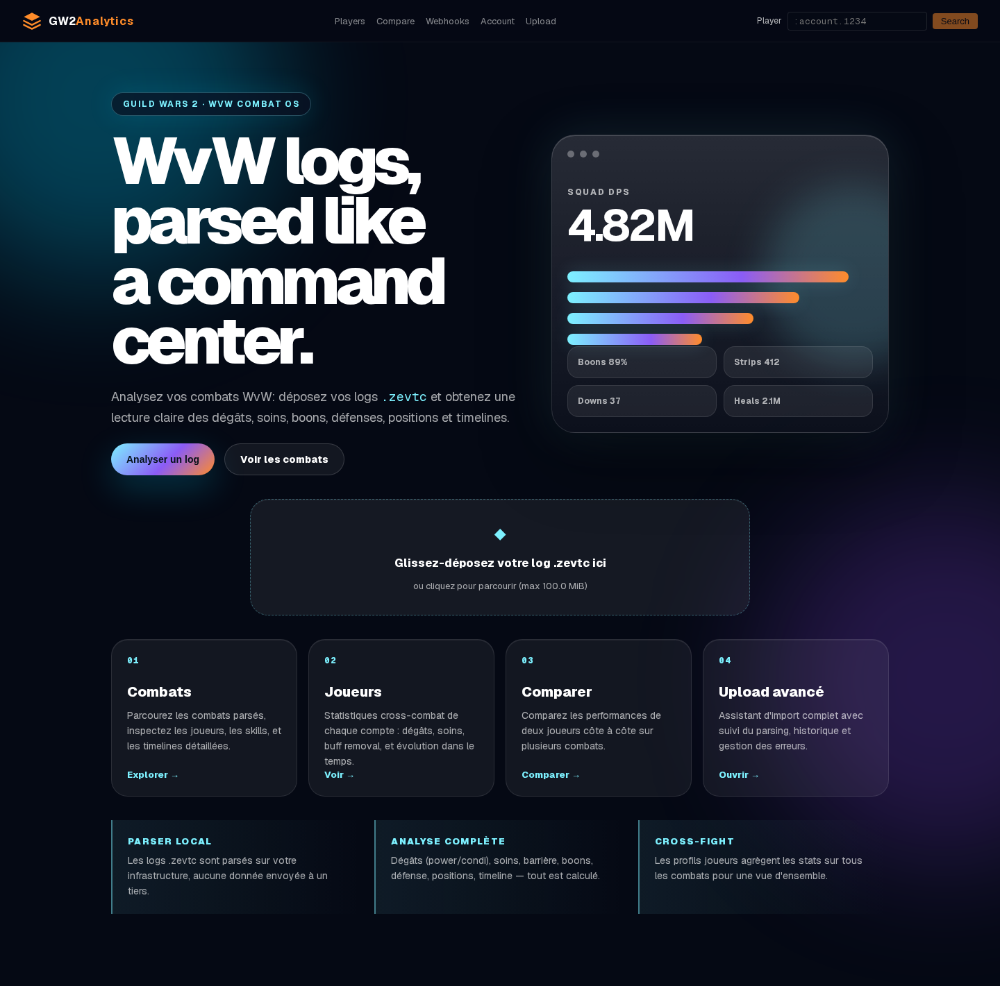
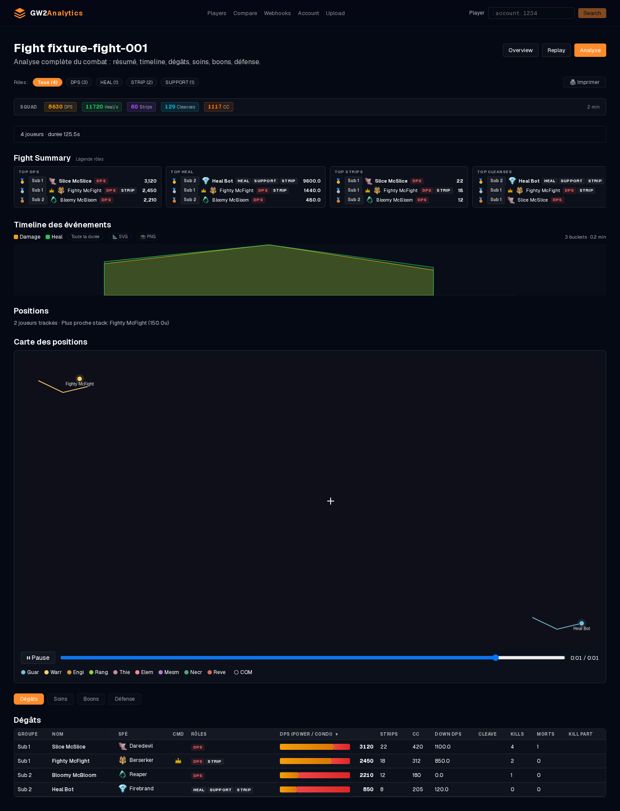
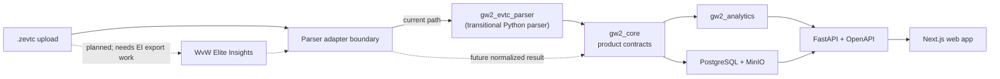

# Gw2Analytics

[](https://github.com/Roddygithub/Gw2Analytics/actions/workflows/ci.yml)
[](https://github.com/Roddygithub/Gw2Analytics/actions/workflows/migration-test.yml)
[](https://github.com/Roddygithub/Gw2Analytics/actions/workflows/security.yml)
[](https://github.com/Roddygithub/Gw2Analytics/actions/workflows/docker-build.yml)

**A Guild Wars 2 World vs. World (WvW) combat analytics platform.**

Gw2Analytics turns `.zevtc` combat logs into fight, player, and squad analysis
for commanders, squad members, and analysts reviewing recorded fights. Explore
what happened in a fight, how players and subgroups contributed, and how player
performance changes across fights. It is built for post-fight analysis, not as a
live DPS meter.

## What you can analyze

| Area | What it provides |
| --- | --- |
| **Fight analysis** | Combat readout for damage, healing, boons, and defense, with per-target and per-skill breakdowns. |
| **Squad analysis** | Squad and subgroup roll-ups for combat activity and player roles. |
| **Player history** | Account profiles, per-fight summaries, and historical timelines across uploaded fights. |
| **Comparison and visualization** | Compare player accounts or fights; explore event timelines, combat replay, and position heatmaps. |
| **Uploads and integration** | Process `.zevtc` uploads in a background worker, use the versioned REST API, or subscribe to upload-completion webhooks. |

## Product views

Selected screenshots from [`docs/screenshots/`](docs/screenshots/):

<table>
  <tr>
    <td align="center"><strong>WvW analytics landing page</strong><br></td>
    <td align="center"><strong>Fight readout and position heatmap</strong><br></td>
  </tr>
</table>

## Architecture

The parser is replaceable at a tested adapter boundary. Product contracts live
in `gw2_core`; analytics, persistence, the API, and the frontend consume those
contracts rather than parser or database internals.


```mermaid
flowchart LR
    upload[".zevtc upload"] --> adapter["Parser adapter boundary"]
    adapter -->|current path| parser["gw2_evtc_parser\n(transitional Python parser)"]
    upload -. "planned; needs EI export work" .-> ei["WvW Elite Insights"]
    ei -.-> adapter
    parser --> core["gw2_core\nproduct contracts"]
    adapter -. "future normalized result" .-> core
    core --> analytics["gw2_analytics"]
    core --> storage["PostgreSQL + MinIO"]
    analytics --> api["FastAPI + OpenAPI"]
    storage --> api
    api --> web["Next.js web app"]
```

`gw2_evtc_parser` remains in the repository temporarily. Product runtime code
can reach it only through `apps/api`'s `services.parser_adapter`; tests enforce
that boundary. `OwnershipInterval`, for example, is owned by `gw2_core` rather
than by the parser package. See the [parser boundary design](docs/architecture/parser-boundary.md).

### Elite Insights status

An EI-based parser path is planned, but it is not implemented. An executed
field-coverage study against Elite Insights 3.26.0.0 detailed-WvW exports found
62 of 82 product fields serviceable. The current export still lacks required
event-level data, including a generic event stream, time-ranged ownership
intervals, position samples under the tested configuration, and per-target
buff removals. The existing parser therefore remains temporarily behind the
adapter until the required EI export work exists. See the [field-coverage gate](docs/validation/ei-field-coverage-gate.md)
and [coverage matrix](docs/validation/ei-field-coverage-matrix.md) for the evidence.

## Developer quickstart

For local development, install `uv`, `pnpm`, Docker Compose, and `make`, then
run:

```bash
make dev-onboard
make dev-stack-up
```

`make dev-onboard` creates `.env` from the development example if needed,
starts PostgreSQL, MinIO, and Redis, syncs Python and web dependencies, applies
database migrations, and generates the web API types. `make dev-stack-up` starts
the FastAPI server, Arq parser worker, and Next.js development server.

- Web app: <http://localhost:3000>
- API and interactive OpenAPI docs: <http://localhost:8000/docs>

The credentials in `.env.example` are development placeholders. Configure real
secrets and services for any non-development deployment. See
[`CONTRIBUTING.md`](CONTRIBUTING.md) for manual setup and contribution details.

## Development checks

Run Python commands from the repository root with `uv`; run web commands from
`web/` after installing its dependencies.

```bash
# Python
uv run ruff check
uv run ruff format --check
uv run mypy libs --no-incremental
uv run mypy apps/api/src --no-incremental
uv run pytest --tb=short

# Web (from web/)
pnpm exec tsc --noEmit
pnpm exec eslint .
pnpm exec vitest run
pnpm exec playwright test --project=chromium
```

The Python integration suite uses the local services started by the quickstart.
CI also runs database migration checks, security scans, Docker builds, and a
visual-regression browser project. See [CI workflows](.github/workflows/).

## API

The FastAPI application exposes a versioned `/api/v1` REST API with upload,
fight, player, comparison, and webhook endpoints. The frontend uses generated
OpenAPI types. With the API running, browse the complete schema and try
endpoints at [`/docs`](http://localhost:8000/docs).

## Technology

| Layer | Technologies |
| --- | --- |
| Backend and analytics | Python 3.12+, FastAPI, Pydantic, SQLAlchemy, Alembic |
| Data and background work | PostgreSQL, MinIO, Redis, Arq |
| Frontend | Next.js, React, TypeScript |
| Operations | Optional OpenTelemetry tracing, Prometheus metrics, Grafana dashboard definition |

## Project documentation

- [Changelog](CHANGELOG.md) — release and change history.
- [Contributing](CONTRIBUTING.md) — local setup, development workflow, and checks.
- [Roadmap](docs/ROADMAP.md) — current product direction and historical context.
- [Parser boundary](docs/architecture/parser-boundary.md) — adapter contract and enforcement.
- [Elite Insights field-coverage gate](docs/validation/ei-field-coverage-gate.md) — migration evidence and decision.
- [Grafana dashboard](monitoring/grafana-dashboard.json) — dashboard definition.

## License and affiliation

Gw2Analytics is **proprietary software, all rights reserved**. Repository
visibility does not grant redistribution or commercial-use rights. See
[`LICENSE`](LICENSE) for the terms and [`NOTICE.md`](NOTICE.md) for a summary.

Gw2Analytics is independent third-party software and is not affiliated with or
endorsed by ArenaNet or any Guild Wars 2 trademark holder.
